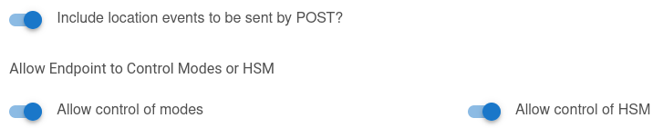

# node-red-contrib-hubitat

This collection of nodes allows to facilitate the use of Hubitat's API


## Installation

### Requirements

* Node-RED version >= 1.X.X
* Hubitat with Maker API version >= 2.2.0.122
* A **dedicated** Maker API instance with the following option enabled (for `mode` and `location` nodes):

  

* Information from the Make API application (app ID, token) (see [Maker API
  documentation](https://docs.hubitat.com/index.php?title=Maker_API) to find them)

### From interface

Install `node-red-contrib-hubitat` from the

* Menu -> Manage palette -> Install -> Search for hubitat -> Install it

   

### From command line

```bash
cd ~/.node-red
npm install node-red-contrib-hubitat
```

## Nodes

* `command`: To send command to Hubitat
* `device`: To keep a device state. It fetch the device state when deployed, then listen for
  webhook events.
* `hsm`: To keep the Hubitat Safety Monitor status (`Armed Home`, `Armed Away`, `Armed Night` and
  `Disarmed`). It fetch the status when deployed, then listen for webhook events.
* `hsm-setter`: To set the Hubitat Hubitat Safety Monitor status (Disarmed, Armed Away, Armed Home ...)
* `mode`: To keep the Hubitat mode (Day, Night, ...)  state. It fetch the mode when deployed, then
  listen for
* `mode-setter`: To set the Hubitat mode (Day, Night, ...)
* `location`: To receive global location events (ex: systemStart, sunrise, sunset)
* `event`: A generic node to receive all events.
* `request`: A generic node to request any Hubitat's endpoints.

* `config`: To setup Hubitat connection information. It also listen for webhook from Hubitat
  to dispatch events to other nodes.

**Note**: `config` node is a configuration node type, which means that it cannot be used directly,
but used by other nodes.

## Documentation

The documentation is embedded in the plugin. Once installed, consult the `Help` section in Node-RED
interface and `Examples` section in `Menu` -> `Import`

Moreover, a lot of help can be found at the [hubitat community
forum](https://community.hubitat.com/t/node-red-nodes-for-hubitat/34386)

You can increase console log verbosity by changing log level from `info` to `debug`.
See [Node-RED documentation](https://nodered.org/docs/user-guide/runtime/logging)

## Technical details

### Configure webhook button

This button only setup the endpoint where to send Hubitat's events. It **doesn't verify that events
will be received by Node-RED**.  It's mandatory to make basic test flow after the configuration to
be sure to receive webhook events.

Since there is no generic command to trigger a webhook event, no automatic configuration can be done.

### Global device cache

When `config` node is deployed (including associated to a new node), it will fetch all devices
attributes/states with Maker API. Then each device will be updated by events received on the webhook
endpoint configured (default: `/hubitat/webhook`)

It means that if Node-RED doesn't receive events (lost on the network) then the cache will be out of
sync.
There are two ways to force refresh the internal cache.

* Restart flows via NR interface (or deploy an hubitat node associated to the config)

  

* send a systemStart message (i.e. simulate restart of Hubitat hub)

  

  

  

### Hardcoded `dataType`

Hubitat API doesn't return the same kind of object when using REST API vs events. Since this plugin
is initialized with REST API and updated with events, it needs to shim the difference to allow the
user to use the same flow with both values.

* REST API will return values as `object` according the
  [dataType](https://docs.hubitat.com/index.php?title=Attribute_Object)
* event will return values as `string`

#### Example

* `GET /apps/api/1/devices/1`

  ```json
  ...
  {
    "name":"temperature",
    "currentValue":20.47,
    "dataType":"NUMBER"
  }
  ...
  ```

* Event

  ```json
  {
    "name": "temperature",
    "value": "20.47"
    ...
  }
  ```

In the event, the quotes indicate a string. If nothing is done internally, it will be up to the user
to always support `string` and `object` in his flows.

### Requests and interface

All requests made by the GUI when configuring a node (ex: fetching devices or commands) is proxied
by the Node-RED server. The browser never communicate directly with Hubitat hub.

### `location` node events

The `location` node is quite weird, because there is no special attribute for *location* events.
Then all events received that doesn't match other kind of events (i.e. `device`, `mode` and `hsm`)
are sent to `location` node.

### Hubitat requests rate limiting

To avoid errors from Hubitat hub, all requests to the hub are throttled to 4 simultaneous requests
with a retry delay of 40ms.

## Development

To run linters:

* `npm run-script linter`

To run unit tests:

* `npm test`

To validate node-red scorecard:

* `node_modules/node-red-dev/bin/run validate -o hubitat-scorecard.json`
